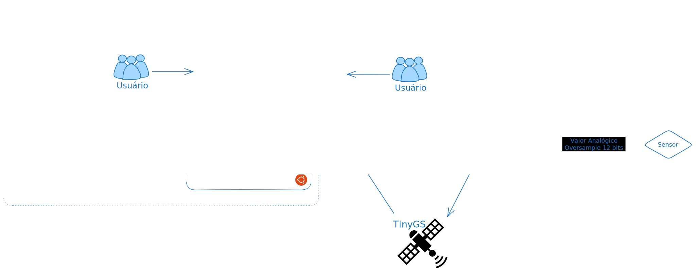

## Hermes

**Interface de aquisição de dados geológicos**, escrita em Python (3.10), utilizando a framework [Django](https://www.djangoproject.com/) (+ [DRF](https://www.django-rest-framework.org/) ) juntamente ao [Prometheus](https://prometheus.io/) e [Grafana](https://grafana.com/).



Desenvolvida para o Departamento de Engenharia Cívil da _Faculdade de Engenharia e Ciências de Guaratinguetá_.

## Licença

[GNU AGPLv3](https://choosealicense.com/licenses/agpl-3.0/)

## Autores

- [@Spearks](https://www.github.com/spearks)

## Deploy

Para fazer o deploy do projeto, recomendamos o uso do Ubuntu Jammy (22.03)

### Inicie com:

```bash
  sudo apt-get update -y
  sudo apt-get upgrade -y
```

### Instale o Docker.io (ou Podman) & Docker-compose:

[Instruções para o Docker.io](https://docs.docker.com/engine/install/ubuntu/)

[Instruções para o Docker-compose](https://docs.docker.com/compose/install/linux/#install-using-the-repository)

### Configure as variáveis de ambiente

```bash
    cp .env.example .env
```

Depois edite o arquivo .env

- [SECRET_KEY] Crie uma chave com o comando:
  `python3 -c 'from django.core.management.utils import get_random_secret_key; print(get_random_secret_key())'`

#

- [PSQL, RBMQ, REDIS, GRAFANA ...] Mantenha a configuração, se usar o _Docker compose_.

#

### Configure os alvos

Para configurar os alvos de aquisição, adicione um arquivo `.yml` em
/Hermes/node/targets/ (Verifique o exemplo, proeti.yaml)

### Instale dependências do front-end

- 1 - [Instale o Node.js](https://nodejs.dev/pt/learn/how-to-install-nodejs/)
- 2 - Instale as dependências `npm install .`
- 3 - Copie as dependências para static/assets & static/scripts

  - `cp node_modules/@fontsource/inter static/assets/fonts/@fontsource/inter `
  - `cp node_modules/flowbite/dist/flowbite.min.js static/scripts/node/ `
  - `cp node_modules/xlsx/dist/xlsx.full.min.js static/scripts/node/ `

### Compile os estilos

Para compilar os estilos, rode o comando:

```bash
npx tailwindcss -i static/src/input.css -o static/src/output.css --minify
```

### Iniciar o projeto

Por fim, para iniciar o projeto rode:

```bashp
docker-compose up -d
```
